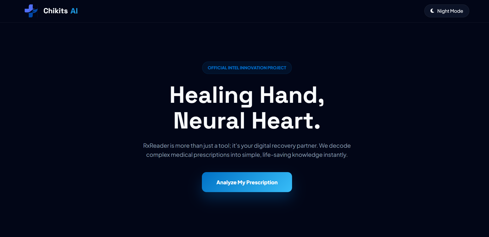

# 🧠 ChikitsAI – Rx Reader

🔗 Live Demo: https://chikits-ai.netlify.app/

🖼️ Project Preview:  

---

## About the Project

ChikitsAI Rx Reader is a simple tool I built to help people understand handwritten medical prescriptions.  
Many times prescriptions are hard to read, so this project tries to convert them into clear, readable text using OCR.

It’s not a medical replacement, just a helper to make things easier for users.

---

## What it does

- Upload or capture a prescription image  
- Extracts text using OCR (Tesseract.js)  
- Cleans and formats the extracted text  
- Shows readable output in a simple UI  
- Reminds users to consult a doctor or pharmacist  

---

## Tech Stack

- HTML  
- CSS  
- JavaScript  
- Tesseract.js  
- Netlify (deployment)  

---

## Why I built this

I wanted to build something practical that solves a real-world problem.  
Reading prescriptions is difficult for many people, so I combined OCR with frontend development to make a basic solution for it.

---

## Important Note

This tool is only for learning and informational purposes.  
It should not be used as a medical decision system.

---

## Future Improvements

- Better AI-based medicine recognition  
- Drug information database integration  
- Mobile app version  
- Multi-language support  

---

## Live Link

👉 https://chikits-ai.netlify.app/